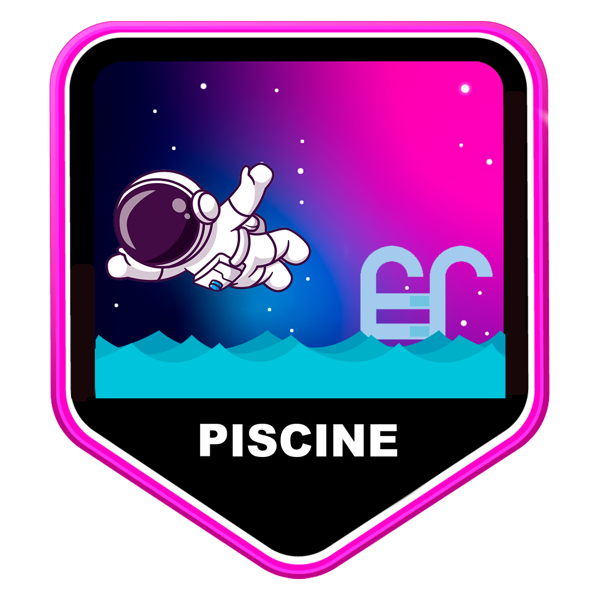

  

# C Piscine @ 42SP

The C Piscine, also known as Piscine, is an intense and highly selective coding program offered by 42SP, a prestigious coding school and community. It serves as the entry point to the software engineering training program at 42. The C Piscine is designed to introduce participants to programming using the C language and assess and enhance their coding and soft skills. Here is a summary of what the C Piscine entails:

## Objective

The C Piscine aims to teach participants the fundamentals of programming in the C language and develop their problem-solving abilities. It provides an immersive coding experience to evaluate participants' skills and readiness for further studies at 42.

## Duration and Format

The C Piscine spans a four-week period during which participants engage in full-time coding. The program follows a highly structured and intensive format, with participants dedicating long hours to coding, assignments, and peer collaboration. For me that meant over 250 hours of dedication.

## Topics Covered

The program covers a range of topics, including:

- Basics of the C programming language, encompassing syntax, variables, data types, and control structures.
- Pointers and memory management, which are critical aspects of C programming.
- Standard library functions and system calls.
- Introduction to algorithms and problem-solving techniques.
- Shell scripting and command-line usage, including shell basics, commands, and scripting languages like Bash.
- Development of coding skills through practical exercises and projects.

## Learning Methodology

The C Piscine employs a peer-based learning approach, encouraging participants to collaborate and support each other in solving coding challenges. The learning environment promotes autonomy, self-learning, and active problem-solving. Participants are expected to effectively manage their time, seek assistance from peers, and explore resources to overcome coding obstacles.

## Assignments and Projects

The C Piscine comprises a series of coding assignments, projects, and exams that participants must complete within specified deadlines. The complexity of assignments progressively increases, fostering participants' knowledge improvement and problem-solving skills development.

## Evaluation and Grading

Participants' performance is evaluated based on the completion of assignments and projects, as well as the quality and functionality of their code. Grading criteria typically include code correctness, adherence to coding standards, and program efficiency. Collaboration, engagement, and participation within the learning community are also considered.

The C Piscine at 42SP is renowned for its rigorous nature and its ability to cultivate a deep understanding of programming concepts and problem-solving skills. It serves as a solid foundation for participants' further studies at 42SP, preparing them for more advanced coding challenges and projects.
